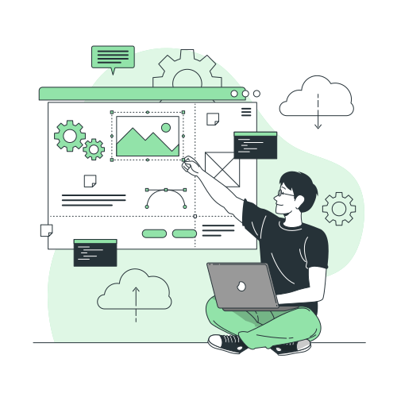
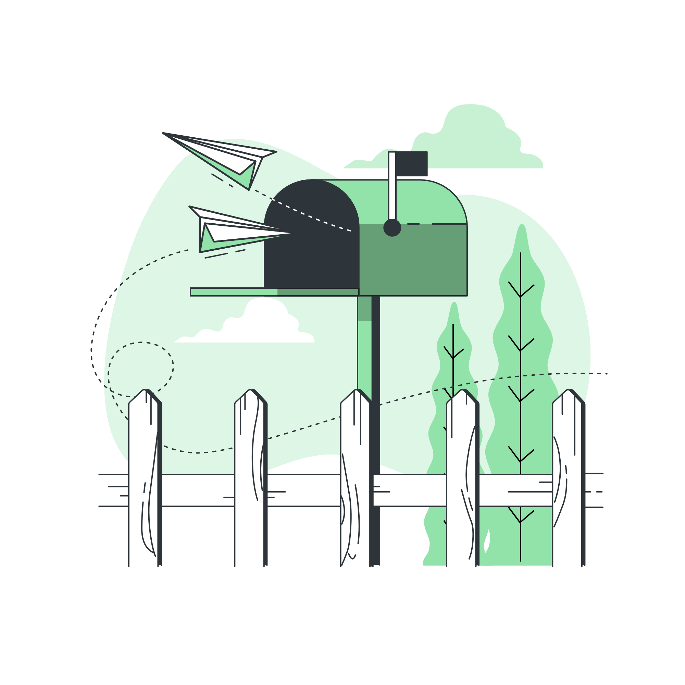

    <h1>TEMEL CMAKE NOTLARI</h1>
    
    
<a href="https://storyset.com/illustration/hello/rafiki">İllüstrasyon Kaynak Bağlantısı</a>

## **👋 Merhaba, Hoş Geldin!**

Ben Kağan, kendi halinde bir geliştiriciyim. Yazılım ve teknoloji üzerine zaman geçirmeyi, müzik dinlerken düşünmeyi, sakinliği seven bir insanım.

Bu kaynağı **zaman zaman kullandığım CMake'i daha iyi temellendirmek ve Türkçe dilini ön plana çıkarmak amacıyla temel içeriklerden, örneklerden faydalanarak oluşturdum. Bu sebeple çeşitli eksikleri, yanlış kısımları, yazım hataları bulunabilir.** Bu tip hataları fark eder veya yeni içeriklerle yardımcı olmak isterseniz "Katkı" başlığı altındaki adımları takip edebilirsiniz. Yardımınızla burada yer alan içeriği daha ileriye taşıyabilir, teknik olarak herkesin gelişimine katkı sağlayacak kapsamlı bir Türkçe kaynak oluşturabiliriz.

Kişisel olarak motivasyonum kullandığım IDE ortamlarının CMake'i otomatik olarak arkaplanda yönetmesi ve CMake'e dair kapsam bilgimin az olmasına dayanıyor. Bir açık kaynak projeye katkıda bulunmak veya grafik/GNU arayüzü olmayan bir ortamda geliştirme yapmak istediğimde tekrar tekrar çeşitli içerikleri inceliyorum. Bu sebeple güzel bir kaynak oluşturmanın ve oluşturduğum kaynağı paylaşmanın verimli olduğunu düşündüm. Bu doğrultuda topluluk sayesinde daha nitelikli düzeltmeler alabileceğimi ve teknik gelişimimi ileriye taşıyacağımı düşünüyorum.

## İçerik ve Akış

    
    
<a href="https://storyset.com/illustration/content/cuate">İllüstrasyon Kaynak Bağlantısı</a>

İçerikler temel düzeydedir ve bir ders akışı gibi birbirlerine bağlantılı olarak ilerlemektedir. Sıralı olarak takip etmeniz önerilir. Daha nitelikli bilgi almak ve ileri düzey öğrenmek için resmi dokümantasyonlara göz atabilir, kaynakça olarak verilen bağlantıları değerlendirebilirsiniz.

- [CMake Hakkında Genel Bilgiler](docs/CMakeHakkindaGenelBilgiler.md)
- [CMake'in Temel Kullanımı](docs/CMakeTemelKullanim.md)
- [CMake Konfigürasyonuna Kütüphane Eklemek](docs/CMakeKutuphaneEklemek.md)
- [Projeyi Alt Dizinlere Ayırmak Ve Yönetmek](docs/ProjeyiAltDizinlereAyirmakVeYonetmek.md)
- [CMake'in Betik Dili](docs/CMakeBetikDili.md)
- [İleri Düzey Konular](docs/ileri_duzey_konular.md)

## Katkı

    
    
<a href="https://storyset.com/illustration/website-creator/bro">İllüstrasyon Kaynak Bağlantısı</a>

Burada yer alan içerikler açık kaynak olarak geliştirilme gayesi taşımaktadır. Katkı sağlamak için çeşitli adımlarla yardımcı olabilirsiniz.

- **Yazım, dil bilgisi, kod, bağlantı referansı gibi noktalarda keşfettiğiniz hata durumlarını bildirmek için** projenin yer aldığı depoya erişerek "Issues" kısmına gidiniz. "New Issue" butonuna tıklayınız. Ardından keşfettiğiniz hatayı, nasıl keşfettiğinizi, düzeltilmesi için ne yapılabileceğini (fikriniz varsa) belirterek kapsamlı olarak açıklayın.

- **Bir hatayı düzeltmek ve kaynağa katkıda bulunmak için** projenin yer aldığı adrese erişerek proje içeriğini "fork" butonu aracılığıyla kendi hesabınıza klonlayınız. Ardından klonlamış olduğunuz proje dosyaları üzerinde gerekli değişiklikleri gerçekleştiriniz. Geliştirmeyi bitirdikten sonra yaptığınız değişiklikleri kontrol edip, gerekiyorsa test ederek tamamlayınız.

    Ardından projenin adresine erişerek "Pull Request" kısmına ulaşınız. Bu sayfada "New pull request" butonuna tıklayarak kendi değişikliklerinizin mevcut olduğu dalı kullanarak projeye birleştirme isteği oluşturabilirsiniz. Lütfen birleştirme isteğinizin başlık ve açıklama bilgisini detaylı olarak yazmaya çalışın.

- **Bu desteklerin yanı sıra sponsor olarak projeyi desteklemek için** projenin sağ kısmında yer alan sponsor butonunu kullanabilirsiniz. Elde edilecek olan kazanç mevcut projenin desteklenmesi, yeni projelerin oluşturulması ve kişisel geliştirme motivasyonuna büyük katkı sağlayacaktır.

"Pull request" isteği oluşturarak nasıl katkı sağlayacağınıza veya "Issue" kısmını kullanarak nasıl hata bildireceğinize dair sorularınız varsa
[bu bağlantıda](https://kagancansit.github.io/pages/blogs/03.acik_kaynaga_katkida_bulunmaya_dair_ilk_adimlar.html) yer alan kaynaktan yararlanabilirsiniz.

**Unutmayın! Gelişmek, geliştirmek ve ilerletmek yeterince zor. Bu sebeple bildirim ve katkı sağlarken tüm topluluk adına anlayışlı, paylaşımcı ve nazik olun. Ayrıca eklediğiniz içeriklerde kullandığınız dış kaynaklar varsa kesinlikle referans vermenizi rica ediyorum. İçerik sahipleri başta olmak üzere, bilgi aldığınız içeriği destekleyenler için emeklerini teslim edelim!**

## Lisans

    
    
<a href="https://storyset.com/illustration/certification/bro">İllüstrasyon Kaynak Bağlantısı</a>

Bu proje GNU General Public License v3.0 altında lisanslanmıştır. Açık kaynak olarak geliştirilme gayesi taşımasıyla birlikte çeşitli kısıtlamalar ve sorumluluklar barındırmaktadır. Detaylı bilgi için [LICENSE](LICENSE) dosyasını inceleyebilirsiniz.

## İletişim

    
    
<a href="https://storyset.com/illustration/mailbox/bro">İllüstrasyon Kaynak Bağlantısı</a>

Projeyi desteklemek ve katkıda bulunmak için "Issue, Pull Request, Sponsor" kısımlarının şu an için gayet yeterli olacağını düşünüyorum. Fakat projeye dair veya yeni bir proje hakkında tartışmak, öneride bulunmak, bir çay/kahve içmek isterseniz [mail adresimden](mailto:kagancansit@hotmail.com) bana ulaşabilirsiniz. 

Sağlıcakla kalın. 👋
