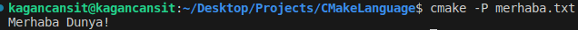
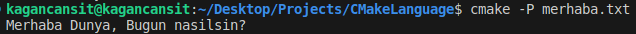
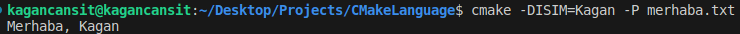
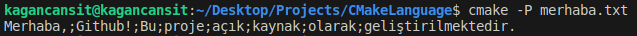
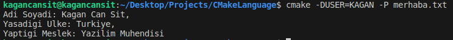
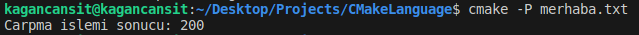
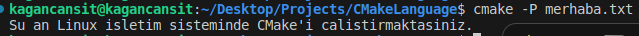
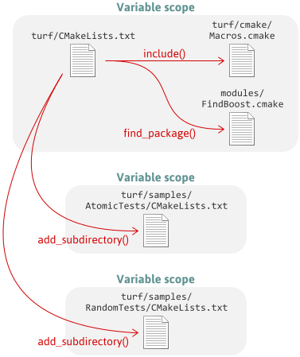
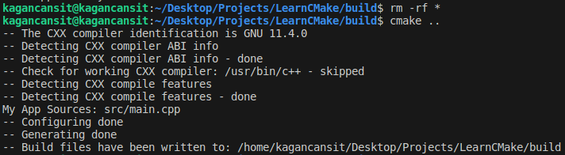

    <h1>CMake Dili</h1>
    
    
<a href="https://storyset.com/illustration/learning-languages/bro">SVG Kaynak Bağlantısı</a>

Bu dokümanda, CMake'in betik dilinin temel prensiplerine ve kurallarına göz atacağız. Dil yapısını anlamak bizlere otomasyon, bağımlıkların yönetimi ve çapraz platform desteğinin sağlanması gibi konularda yardımcı olacaktır.

Burada yer alan içeriğin dayandığı temel kaynak [bu bağlantıda](https://preshing.com/20170522/learn-cmakes-scripting-language-in-15-minutes/) yer almaktadır.

## **Mesaj/Log İçeriklerini Yazdırmak**

Öncelikle, bir dizin oluşturup içine "merhaba.txt" adında bir dosya ekleyelim ve içine yazdığımız mesajı görmek için bir örnek yapalım:

    CMakeLanguage/
        └── merhaba.txt

*merhaba.txt* içerisine yazdırmak istediğiniz mesajı ekleyin.

    message("Merhaba Dunya!")

Terminal aracılığıyla **cmake** komutu **-P** komutuyla çalıştırın.

    cmake -P merhaba.txt

    

## Değişkenler Bir Dizi Olarak Kabul Edilir 

CMake'de değişkenler bir dizi olarak kabul edilir. Atama operatörleriyle değişken değeri atanamaz. Bunun yerine **set** fonksiyonu kullanılır.

    set(testParameter "Bugun nasilsin?")

Bir değişken yazdırılırken **${}** ile çevrelenir.

    message("Merhaba Dunya, ${testParameter}")

    

Bu kullanımın yanı sıra bir değişken tanımlayıp dosya içerisinde set etmeden gerekli parametreyi terminal aracılığıyla geçebilirsiniz.

*merhaba.txt*

    message("Merhaba, ${ISIM}")

Terminal aracılığıyla parametreyi dolduralım.

    cmake -DISIM=Kagan -P merhaba.txt

    

**! Parametre boş bırakılması durumunda boş bir dizi olarak kabul edilir.**

    

## Parametre Atamaları ve Genel İşleyiş Akışında Tırnağın Önemi

Parametre değerleri tırnak kullanılmadan geçilmesi durumunda CMake geçilen parametreleri ayrı dizi listeleri kabul ederek noktalı virgül (;) kullanarak birleştirir. 

    set(LIST Merhaba, Github! Bu proje açık kaynak olarak geliştirilmektedir.)
    message("${LIST}") # Eğer tırnak kullanılmaz ise birleşik olarak çıktı üretir.

    

Burada parametreler ayrı dizeler olarak ele alındığı için veri üzerinde manipülasyon yapılabilir.

*"Github!" ifadesini değiştirmek;*

    string(REPLACE "Github!" "hoşgeldiniz!" LIST "${LIST}")

*Listeden herhangi bir veriyi çıkarmak;*

    list(REMOVE_ITEM LIST "olarak")

Tırnak ile atanmamış değerleri foreach kullanarak alt alta yazdırabilir veya liste verilerine erişerek işlem yapabilirsiniz.

    foreach(ARG ${LIST})
        message("${ARG}")
    endforeach()

**CMake'in genel akışında kullanım için tırnak kullanarak içeriklerin yazılması önerilir. Fakat karşılaştığınız süreçlerin çözümünde burada bahsedilen farkı kullanarak çözüm üretebilirsiniz.**

## Sınıf ve Değişken Yapısı Bulunmaz

Sınıf ve farklı tipte değişkenler kullanılamadığı için iç içe geçmiş değişken referanslarını kullanabilirsiniz.

    set(KAGAN_FULL_NAME "Kagan Can Sit")
    set(KAGAN_LIVE_COUNTRY "Turkiye")
    set(KAGAN_JOB "Yazilim Muhendisi")

    message("Adi Soyadi: ${${USER}_FULL_NAME},\nYasadigi Ulke: ${${USER}_LIVE_COUNTRY},\nYaptigi Meslek: ${${USER}_JOB}")

    

Burada **SET** fonksiyonuyla ile **USER** değişkeni dosya içerisinde de atanabilirdi.

## İfadelerin Her Biri Komut Kabul Edilir ve Geri Dönüş Değerleri Bulunmaz

Bash script gibi diğer betik dillerinin aksine işlem sonucunda geriye değer döndürülmez. Komutların parametrelerin listesini alır. Parametreler genellikle boşluk karakterleriyle birbirinden ayrılır.

    set(TEST "Test Data") # Doğru şekilde parametreler ayrılmıştır.
    
    set(TEST, "Test Data") # X Kullanılmaz
    set(TEST; "Test Data") # X Kullanılmaz

Geri dönüş değeri alınabilmesi için C VE C++ dillerinde kullandığımız adresci iletilmesine benzer bir yönetem kullanılır. Bu durumu incelemek için aşağıdaki örneği inceleyebilirsiniz;

Matematiksel işlemleri gerçekleştirmek üzere **math** komutu bulunur. İlk argüman **EXPR**, ikinci argüman **sonucun atanacağı değişken**, üçüncü argüman ise gerçekleştirilmek istenen ifadedir.

    math(EXPR RESULT "10 * 20")
    message("Carpma islemi sonucu: ${RESULT}")

    

## Akış Kontrolü

Genel olarak bildiğimiz şartlı koşullar burada geçerli olsa da yazım açısından farklılıklar bulunur. Örneğin bir **if()** ifadesi oluşturulduğunda sonlandırılması için **endif()** kullanılmalıdır. (**while() - endwhile()**)

İfadelerin karşılaştırılması için çeşitli şartlar tanımlıdır. Örneğin AND, OR, EQUAL, LESS, LESS_EQUAL, GREATER, GREATER_EQUAL, STREQUAL... Bu ifadelere dair kapsamlı bilgi [CMake resmi sitesinde](https:://cmake.org/cmake/help/latest/command/if.html) yer almaktadır.

    if(UNIX) # WIN32 veya MSVC kullanilabilir
        message("Su an Linux isletim sisteminde CMake'i calistirmaktasiniz.")
    endif()

Benzer bir if şartı örneği;

    if(NOT WIN32)
        message("Su an Linux isletim sisteminde CMake'i calistirmaktasiniz.")
    endif()

    

## Fonksiyon ve Makro Tanımlamak

CMake'de bi fonksiyon ve makro tanımlamak koşul şartı yazmaya benzer bir yapıya sahiptir.
**funciton/endfunction - macro/endmacro** şeklinde kullanılabilirler.

Fonksiyonlar kendi kapsamlarında çalışmaktadırlar, global olarak parametreleri etkileyemezler. Bir fonksiyondan dönüş değeri alabilmek için dışarıdan değişkenin parametre geçilmesi gerekir. Geçilen parametre **PARENT_SCOPE** bayrağıyla doldurulabilir.

    function(calculateVersion RETURNVALUE VERSION)
        string(REPLACE "." "" VERSION_NUMBER ${VERSION})
        set(${RETURNVALUE} ${VERSION_NUMBER} PARENT_SCOPE)
    endfunction()

    calculateVersion(VERSIONVALUE "10.26.98")
    message("${VERSIONVALUE}")

Makrolar, işleyiş ve yapı olarak fonksiyonlara benzerler. Fakat makrolar, çağrı yapılan kademeyle aynı kapsamda çalışır. Bu sebeple değişken değerleri direk olarak bulunduğu alanda tanımlanarak set edilir.

    macro(calculateVersion RETURNVALUE VERSION)
        string(REPLACE "." "" ${RETURNVALUE} ${VERSION})
    endmacro()

    calculateVersion(MAJOR_VERSION_VALUE "10.26.98")
    message("${MAJOR_VERSION_VALUE}")

İki kullanımda aynı çıktıyı üretir. Aralarında bulunan temel fark değişken içeriklerini tanımlandığı kapsam alanlarıdır. Fonksiyonların farklı dosya ve alanlarda kullanılabilmesi, makroların ise dosyaya özgü olması daha muhtemeldir.

    

## Diğer Komut Dosyalarını Dahil Etmek

Kütüphane örneğinde kullandığımız gibi CMake işleyiş sırasında dizin yapısında yer alan **CMakeLists.txt** komut dosyaları aracılığıyla kapsamları yürütür. **add_subdirectory** gibi komutlarla kullanılan bu yöntem çeşitli alt kütüphaneleri ve içerikleri projenize dahil etmenizi sağlar.

Bunun yanı sıra **find_package** komutu yardımıyla dış kitaplıkları arayabilir ve projenize dahil edebilirsiniz. Açıklama ve örnek için bu dokümanının başında verilen kaynağı daha detaylı okuyabilirsiniz.

    
    
<a href="https://preshing.com/20170522/learn-cmakes-scripting-language-in-15-minutes/">Görsel Kaynak Bağlantısı</a>

## CMake Dosyalarından Özellikleri Almak ve Ayarlamak

CMake dosyamızda **add_executable**, **add_library**, **add_custom_target** gibi komutlar aracılığıyla içerikler dahil edebildiğimizi biliyoruz. Bu içeriklerin özelliklerini **get_property** ve **set_property** komutlarıyla okuyabilir, değiştirebilirsiniz.

    cmake_minimum_required(VERSION 3.22.1)
    project(
        CMakeLearn
        VERSION 0.0.1
        DESCRIPTION "CMake Learn Application"
        LANGUAGES CXX
    )

    set(CMAKE_CXX_XOMPILER g++)
    set(CMAKE_CXX_STANDARD 17)
    set(CMAKE_CXX_STANDARD_REQUIRED true)

    add_subdirectory(externally/mylibrary)
    add_executable(CMakeLearn src/main.cpp)

    get_property(MYAPP_SOURCES TARGET CMakeLearn PROPERTY SOURCES)
    message("My App Sources: ${MYAPP_SOURCES}")

    target_link_libraries(CMakeLearn PRIVATE sayHelloFromMyLibrary)

Çıktıyı incelerseniz, mevcut projenin **source** dizini bilgisinin **My App Source:** satırıyla yazdırıldığını görebilirsiniz.

    

# Kaynakça

* ChatGPT 3.5'ten yararlanılmıştır.
* [CMake 2.8.12 Documentation](https://cmake.org/cmake/help/v2.8.12/cmake.html)
* [CMake Tutorial](https://cmake.org/cmake/help/latest/guide/tutorial/index.html)
* [Learn CMake's Scripting Language in 15 Minutes](https://preshing.com/20170522/learn-cmakes-scripting-language-in-15-minutes/)
* [cmake-language(7)](https://cmake.org/cmake/help/latest/manual/cmake-language.7.html)
* [CMake Documentation - if](https://cmake.org/cmake/help/latest/command/if.html) 
* [OS specific instructions in CMAKE: How to?](https://stackoverflow.com/questions/9160335/os-specific-instructions-in-cmake-how-to)

    <a href="ProjeyiAltDizinlereAyirmakVeYonetmek.md"> < Önceki Sayfaya Dön</a>
    &emsp;&emsp;&emsp;&emsp;&emsp;&emsp;&emsp;&emsp;&emsp;&emsp;&emsp;&emsp;&emsp;&emsp;&emsp;&emsp;&emsp;&emsp;&emsp;&emsp; 
    <a href="#"> Sonraki Sayfaya İlerle ></a>

