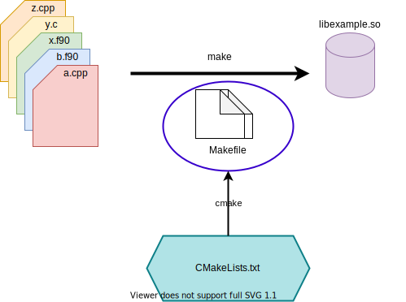
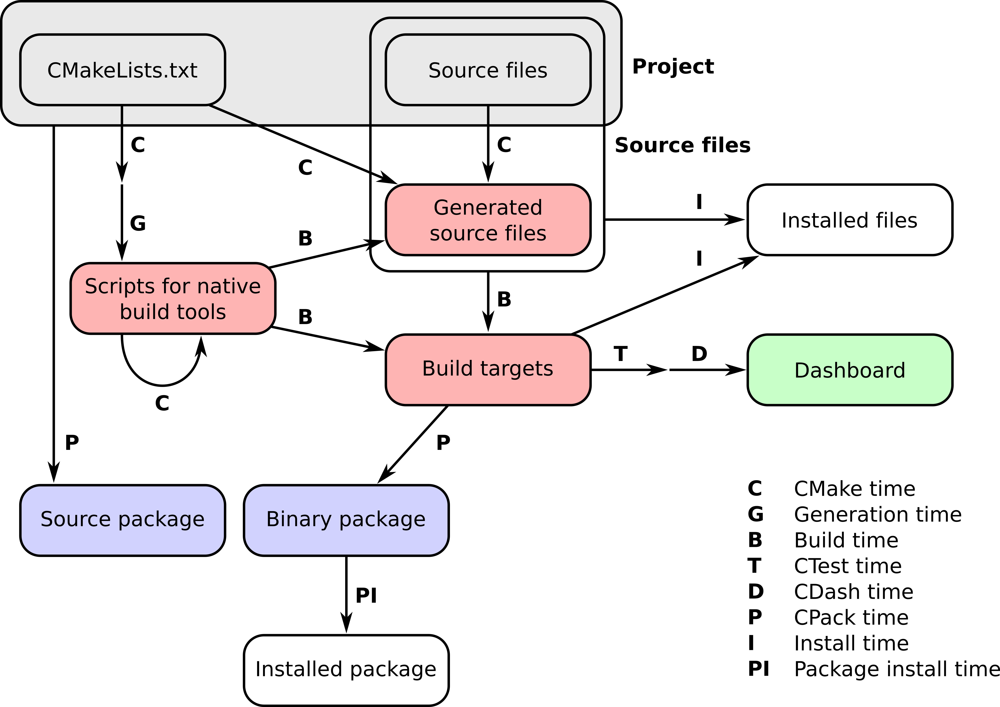

    <h1>CMake Hakkında Genel Bilgiler</h1>
    
    
<a href="https://cmake.org/wp-content/uploads/2023/08/CMake-Logo.svg">SVG Kaynak Bağlantısı</a>

    

## CMake Nedir?

CMake, **"Cross-Platform Make"** kısaltmasıyla bilinen bir derleme sistemi oluşturucusudur. Temel olarak, projenin kaynak kodunu derlemek için gereken Makefile'ları veya diğer derleme senaryolarını otomatik olarak oluşturur. Bu işleyiş farklı işletim sistemlerinde, derleyicilerde ve bağımlılıklarda çalışabilme avantajı sağlar.

> CMake'in otomatik olarak oluşturduğu ve yönettiği Make (Makefile) dosyası, bir programın nasıl derleneceğini, hangi dosyaların bir araya getirilmesi gerektiğini ve bağlı programların nasıl çalıştırıldığını belirten bir metin dosyasıdır. Özellikle C, C++ ve benzeri dillerde yazılmış programların derlenmesi ve yönetilmesi için kullanılır.  [Bağlantı](https://www.youtube.com/watch?v=GExnnTaBELk) üzerinde  yer alan videodan daha kapsamlı bilgi alabilirsiniz.

## CMake ve Make Süreci

CMake, çeşitli yapılandırma ve spesifik ayarları dizine özgü olarak oluşturulan "**CMakeLists.txt**" olarak isimlendirilmiş dosyalar sayesinde gerçekleştirir.

    
    
<a href="https://enccs.github.io/cmake-workshop/_images/build-systems.svg">Akış Çizimi Kaynak Bağlantısı</a>

## Özellikler

CMake'in temel işlevleri şunlardır:

* **Proje Yapılandırması:** CMake, projenin gerekli derleme ortamını (derleyici, bağımlılıklar) tanımlar ve yapılandırır. Gerçekleştirilen tanımlamalar kodun taşınabilirliğini arttırarak diğer platformlarda çalışma ve analiz edilebilme kabiliyetini arttırır. Terminal üzerinden "**cmake --help**" komutu aracılığıyla gelen menüyü incelerseniz. Farklı derleyeciler için CMake'i kullanabileceğinizi görüntüleyebilirsiniz.

    

* **Makefile Oluşturma:** CMake, projenin derleme işlemlerini otomatikleştirmek için platforma özgü olarak Makefile ve ek dosyalarını (Örn; Visual Studio proje dosyaları, Xcode proje dosyaları vb.) otomatik olarak oluşturur. Geliştirme sürecini kolaylaştırarak, hata yapılması ihtimalini düşürür.

* **Bağımlılıkların Yönetimi:** CMake, projenin bağımlılıklarını (kütüphaneler, kullanılan dil standardı, versiyon zorunlukları vb.) ve dış kütüphaneleri yönetmek içinde kullanılabilir.

        # Minimum olması gereken CMake versiyonu
        cmake_minimum_required(VERSION 3.22.1)

        # Minimum olması gereken C++ standardı
        set(CMAKE_CXX_STANDARD 17)

* **Proje Dökümantasyonu:** CMake, projenin yapılandırılması ve derlenmesiyle ilgili dökümantasyon oluşturabilir. Bu madde için en güzel örneklerden biri sanırım [doxygen](https://www.doxygen.nl/index.html) olacaktır.

* **Testlerin Yürütülmesi:** CMake, projenin testlerini otomatikleştirmek ve yürütmek için de kullanılabilir. 

# Örnek akış

    
    
<a href="https://github.com/ENCCS/cmake-workshop/blob/main/content/img/cmake-times.jpg">Akış Çizimi Kaynak Bağlantısı</a>

# Temel CMake (CMakeLists.txt dosyası) Örneği

    # Minimum olması gereken CMake versiyonu
    cmake_minimum_required(VERSION 3.22.1)
    
    # Projenin adı, versiyon numarası, açıklaması ve kullanılan dil(C++)
    project(
        CMakeLearn
        VERSION 0.0.1
        DESCRIPTION "CMake Learn Application"
        LANGUAGES CXX
    )

    # Projenin C++ standart versiyonu
    set(CMAKE_CXX_STANDARD 17)
    
    # Yürütülebilir dosyanın adı ve derlenecek olan dosya
    add_executable(test testApp.cpp)

# Kaynakça

* Temel tanım ChatGPT 3.5 aracılığıyla oluşturulmuş, ardından içerik genişletilmiştir.
* [CMake 2.8.12 Documentation](https://cmake.org/cmake/help/v2.8.12/cmake.html)
* [What is Makefile and make? How do we use it?](https://medium.com/@ayogun/what-is-makefile-and-make-how-do-we-use-it-3828f2ee8cb)
* [ENCSS - CMake hands-on workshop](https://enccs.github.io/cmake-workshop/)
* [Why CMake?](https://www.youtube.com/watch?v=kekw7eGb8Mw&list=PLsCsQorDHC9Wism5Xlp8ZKtKeGBeCJJ72)
* [C Programming: Makefiles](https://www.youtube.com/watch?v=GExnnTaBELk)
* [Doxygen](https://www.doxygen.nl/index.html)

    <a href="../README.md"> < Ana Sayfaya Dön</a>
    &emsp;&emsp;&emsp;&emsp;&emsp;&emsp;&emsp;&emsp;&emsp;&emsp;&emsp;&emsp;&emsp;&emsp;&emsp;&emsp;&emsp;&emsp;&emsp;&emsp;
    <a href="CMakeTemelKullanim.md"> Sonraki Sayfaya İlerle ></a>

