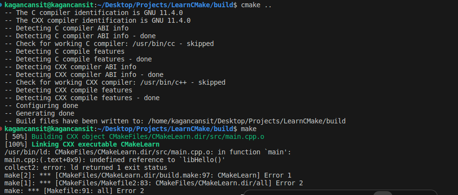
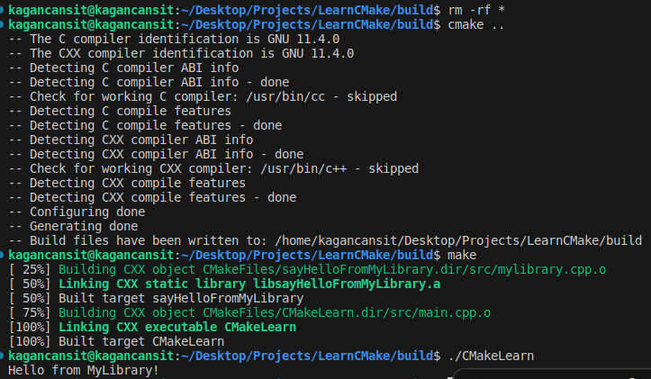
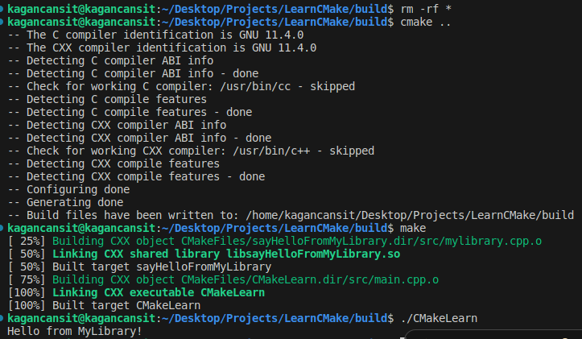
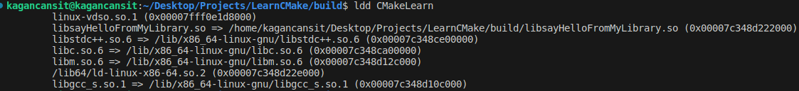

    <h1>CMake Konfigürasyonuna Kütüphane Eklemek</h1>
    
    
<a href="https://storyset.com/illustration/software-code-testing/bro">SVG Kaynak Bağlantısı</a>

Bu adımda projemizi geliştirmek ve CMake'i daha iyi kavrayabilmek için çeşitli düzenlemeler yaparak örneğimizi bir adım öteye taşıyacağız. İlk olarak, dizin yapımıza yeni bir header klasörü ekleyeceğiz ve bu klasörün içine **mylibrary.h** dosyasını oluşturacağız. Ardından src klasörü içinde **mylibrary.cpp** dosyasını oluşturacağız. Son olarak **main.cpp** ve **CMakeLists.txt** dosyamızı güncelleyeceğiz.

*Son durumda olması gereken dizin yapısı;*

    ├── build
    ├── CMakeLists.txt
    ├── header
    │   └── mylibrary.h
    └── src
        └── main.cpp
        └── mylibrary.cpp

*mylibrary.h dosyası;*

    #ifndef MYLIBRARY_H
    #define MYLIBRARY_H

    #include <iostream>

    void libHello();

    #endif

*mylibrary.cpp dosyası;*

    #include "../header/mylibrary.h"

    void libHello() {
        std::cout << "Hello from MyLibrary!" << std::endl;
    }

*main.cpp dosyası;*

    #include <iostream>

    #include "../header/mylibrary.h"

    int main() {
        libHello();
        return 0;
    }

Şimdi gerekli dosyaları oluşturduk. Ancak, **CMakeList.txt** dosyasında değişiklikler yapmadan önce **cmake** ve **make** komutlarını çalıştırarak mevcut durumu inceleyelim.

    cd build/
    cmake ..
    make

    

**cmake** komutu herhangi bir hata vermeden çalışırken, **make** komutunu kullandığımızda kütüphane header dosyası için bilinmeyen referans hatası aldık. **CMakeLists.txt** dosyasını inceleyerek hatanın sebebini anlayabiliriz.

    cmake_minimum_required(VERSION 3.22.1)
    project(
        CMakeLearn
        VERSION 0.0.1
        DESCRIPTION "CMake Learn Application"
        LANGUAGES CXX
    )   
    add_executable(CMakeLearn src/main.cpp)

Şu anda **CMakeLists.txt** dosyamızda yalnızca **main.cpp** belirtilmiş durumda, yeni eklediğimiz kütüphane için gerekli olan nesne içerikleri ve diğer dosyalar oluşturulmuyor. **make** komutuyla derleme yapmak istediğimizde eksik içeriğe sahip olan **makefile** ve diğer içerikler sonucunda süreç tamamlanamıyor.

Nesnelerin ve diğer içeriklerin doğru şekilde oluşması için en hızlı çözüm kütüphane için eklediğimiz cpp dosyamızın **add_exectable()** komutuna eklenmesi.

    add_executable(CMakeLearn src/main.cpp src/mylibrary.cpp)

    

**Fakat bu yöntem sağlıklı bir çözüm yolu değil.** Kütüphane olarak ekleyeceğimiz tüm içerikleri executable fonksiyonuyla takip ederek kütüphaneler arasındaki ilişkileri, derleme bağımlılıklarını yönetemeyiz.

Bunun için CMake'te yer alan **add_library()** fonksiyonunu kullanabiliriz.

    add_library(
        sayHelloFromMyLibrary
        header/mylibrary.h
        src/mylibrary.cpp
    )

add_library fonksiyonuyla kütüphanenin adını, header ve cpp dosyalarını CMake'e bildiriyoruz. Kütüphaneyi yürütülebilir dosyayla ilişkilendirmek ve linklemek için **target_link_libraries()** fonksiyonunu kullanacağız.

    target_link_libraries(CMakeLearn PRIVATE sayHelloFromMyLibrary)

Bu fonksiyonla birlikte yürütülebilir olan "CMakeLearn" ile sayHelloFromMyLibrary'sini linklemiş oluyoruz.

**Not**: Burada yer alan ikinci parametre için kısa bir açıklama yapmak gerekirse;
* PRIVATE parametresi oluşturulan bağlantının yalnızca belirtilen yürütülebilir dosya için kullanılacağını,
* PUBLIC parametresi ise belirtilen yürütülebilir dosyayla birlikte onu kullanan herkesin kullanabileceğini,
* INTERFACE ise uygulamanın kendisinin kullanamayacağını, onu kullanan uygulamaların kullanabileceğini belirtir.

Son durumda oluşan **CMakeLists.txt** dosyamız aşağıdaki gibi olacaktır. 

    cmake_minimum_required(VERSION 3.22.1)
    project(
        CMakeLearn
        VERSION 0.0.1
        DESCRIPTION "CMake Learn Application"
        LANGUAGES CXX
    )      

    add_library(
        sayHelloFromMyLibrary
        header/mylibrary.h
        src/mylibrary.cpp
    )

    add_executable(CMakeLearn src/main.cpp)
    target_link_libraries(CMakeLearn PRIVATE sayHelloFromMyLibrary)

Bu değişiklikler sonrasında yeniden aynı komutları kullanarak CMake aracılığıyla gerekli dosyaları oluşturup, make ile projeyi derleyebiliriz.

    cd build/
    rm -rf *
    cmake ..
    make

    

**make** komutunun çıktısını incelediğimizde eklemiş olduğumuz kütüphanenin nesne dosyasının oluşturulduğunu ardından statik olarak linklendiğini görebilirsiniz.

## add_library Fonksiyonu Aracılığıyla Kütüphanenin Statik, Shared Olarak Belirlenmesi 

**add_library()** fonksiyonunun varsayılan konfigürasyonunda kütüphane içerikleri statik olarak belirlenmektedir. Bunu değiştirmek ve düzenlemek için parametre olarak belirtebilirsiniz.

    add_library(
        sayHelloFromMyLibrary SHARED
        header/mylibrary.h
        src/mylibrary.cpp
    )

    

Şimdi **ldd** komutu yardımıyla yürütülebilir olarak belirlediğimiz **CMakeLearn** uygulamasını kontrol edecek olursak kendi kütüphanemizi görebiliriz.

    ldd CMakeLearn

    

**Not:** Sadece terminal üzerinden düzenleme yaparak kütüphane içeriğinizin SHARED veya STATIC olmasını belirleyebilirsiniz.

    cmake -D BUILD_SHARED_LIBS=TRUE .

# Kaynakça

* ChatGPT 3.5'ten yararlanılmıştır.
* [CMake 2.8.12 Documentation](https://cmake.org/cmake/help/v2.8.12/cmake.html)
* [CMake Tutorial](https://cmake.org/cmake/help/latest/guide/tutorial/index.html)
* [ENCSS - CMake hands-on workshop](https://enccs.github.io/cmake-workshop/)
* [How to CMake Good - 1b - Adding a Library](https://youtu.be/abuCXC3t6eQ?si=7pXmDg5BHh17Zbsn)

    <a href="CMakeTemelKullanim.md"> < Önceki Sayfaya Dön</a>
    &emsp;&emsp;&emsp;&emsp;&emsp;&emsp;&emsp;&emsp;&emsp;&emsp;&emsp;&emsp;&emsp;&emsp;&emsp;&emsp;&emsp;&emsp;&emsp;&emsp;
    <a href="ProjeyiAltDizinlereAyirmakVeYonetmek.md"> Sonraki Sayfaya İlerle ></a>

