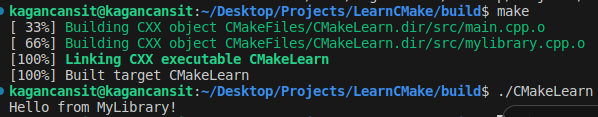

    <h1>CMake Konfigürasyonuna Kütüphane Eklemek</h1>
    
    
<a href="https://storyset.com/illustration/software-code-testing/bro">SVG Kaynak Bağlantısı</a>

Projemizi geliştirmek ve CMake'i daha iyi kavrayabilmek için çeşitli düzenlemeler yaparak örneğimizi bir adım öteye taşıyacak ardından **CMakeLists.txt** dosyamızı düzenleyerek projemizin doğru bir şekilde derlenmesini ve kullanılabilmesini sağlayacağız.

İlk olarak CMake dosyamızda değişiklik yapmadan gerekli değişiklikleri yapalım. Dizin yapımızı hatırlayacak olursak;

    

Şimdi bir header klasörü ve bu klasörün içerisine **mylibrary.h** dosyasını oluşturup aşağıdaki kod parçacığını ekleyeceğiz.

    #ifndef MYLIBRARY_H
    #define MYLIBRARY_H

    #include <iostream>

    void libHello();

    #endif

Bu işlemin ardından src klasörü içerisinde **mylibrary.cpp** dosyasını oluşturarak aşağıdaki kod parçacığını ekleyeceğiz.

    #include "../header/mylibrary.h"

    void libHello() {
        std::cout << "Hello from MyLibrary!" << std::endl;
    }

**main.cpp** dosyamızı da güncelliyoruz.

    #include <iostream>

    #include "../header/mylibrary.h"

    int main() {
        libHello();
        return 0;
    }

Şimdi gerekli dosya içeriklerimizi oluşturduk. **CMakeList.txt** dosyamızı güncellemeden **cmake** ve **make** komutunu çalıştıralım ve inceleyelim.

    cd build/
    cmake ..
    make

    

**cmake** komutu herhangi bir hata vermeden çalıştı fakat **make** komutunu kullandığımızda kütüphane header dosyası için bilinmeyen referans hatası aldı. Peki, neden?

**CMakeLists.txt** dosyasını inceleyerek sebebini anlayabiliriz.

    cmake_minimum_required(VERSION 3.22.1)
    project(CMakeLearn VERSION 0.0.1)      
    add_executable(CMakeLearn src/main.cpp)

CMake dosyamızda şu anda nesne içeriklerini ve konfigürasyon dosyalarını oluşturmak için yalnızca **main.cpp** belirtilmiş. Bu sebeple yeni eklediğimiz kütüphane için gerekli olan nesne içerikleri ve diğer dosyalar oluşturulmuyor. Bizlerde **make** komutuyla derleme yapmak istediğimizde eksik içeriğe sahip olan **makefile** ve diğer içerikler sebebiyle hata alıyoruz. Çünkü gerçekten kütüphanemize ait nesne içerikleri derlenme işlemi sırasında build dizininde bulunmuyor.

Nesnelerin ve diğer içeriklerin doğru şekilde oluşması için en hızlı çözüm kütüphane için eklediğimiz cpp dosyamızında **add_exectable()** komutuna eklenmesi.

    add_executable(CMakeLearn src/main.cpp src/mylibrary.cpp)

    

**Fakat bu yöntem sağlıklı bir çözüm yolu değil.** Kütüphane olarak ekleyeceğimiz tüm içerikleri executable fonksiyonuyla takip ederek kütüphaneler arasındaki ilişkileri yönetemeyiz.

Bunun için CMake'te yer alan **add_library()** fonksiyonunu kullanabiliriz.

    add_library(
        sayHelloFromMyLibrary
        header/mylibrary.h
        src/mylibrary.cpp
    )

add_library fonksiyonuyla kütüphanenin adını, header ve cpp dosyalarını CMake'e bildiriyoruz. Fakat yürütülebilir olan **main.cpp** ile kütüphaneyi ilişkilendirmedik. Bu sebeple yalnızca bu değişiklik yeterli olmayacaktır. Kütüphaneyi yürütülebilir dosyayla ilişkilendirmek ve linklemek için **target_link_libraries()** fonksiyonunu kullanacağız.

    target_link_libraries(CMakeLearn PRIVATE sayHelloFromMyLibrary)

Bu fonksiyonla birlikte yürütülebilir olan "CMakeLearn" ile sayHelloFromMyLibrary'sini linklemiş oluyoruz.

**Not**: Burada yer alan ikinci parametre için kısa bir açıklama yapmak gerekirse;
* PRIVATE parametresi oluşturulan bağlantının yalnızca belirtilen yürütülebilir dosya için kullanılacağını,
* PUBLIC parametresi ise belirtilen yürütülebilir dosyayla birlikte onu kullanan herkesin kullanabileceğini,
* INTERFACE ise uygulamanın kendisinin kullanamayacağını, onu kullanan uygulamaların kullanabileceğini belirtir.

Son durumda oluşan **CMakeLists.txt** dosyamız aşağıdaki gibi olacaktır. 

    cmake_minimum_required(VERSION 3.22.1)
    project(CMakeLearn VERSION 0.0.1)       

    add_library(
        sayHelloFromMyLibrary
        header/mylibrary.h
        src/mylibrary.cpp
    )

    add_executable(CMakeLearn src/main.cpp)
    target_link_libraries(CMakeLearn PRIVATE sayHelloFromMyLibrary)

Bu değişiklikler sonrasında yeniden aynı komutları kullanarak CMake aracılığıyla gerekli dosyaları oluşturup, make ile projeyi derleyebiliriz.

    cd build/
    rm -rf *
    cmake ..
    make

    

**make** komutunun çıktısını incelediğimizde eklemiş olduğumuz kütüphanenin nesne dosyasının oluşturulduğunu ardından statik olarak linklendiğini görebilirsiniz.

## add_library Fonksiyonu Aracılığıyla Kütüphanenin Statik, Shared Olarak Belirlenmesi 

**add_library()** fonksiyonunun varsayılan konfigürasyonunda kütüphane içerikleri statik olarak belirlenmektedir. Bunu değiştirmek ve düzenlemek için parametre olarak belirtebilirsiniz.

    add_library(
        sayHelloFromMyLibrary SHARED
        header/mylibrary.h
        src/mylibrary.cpp
    )

    

Şimdi **ldd** komutu yardımıyla yürütülebilir olarak belirlediğimiz **CMakeLearn** uygulamasını kontrol edecek olursak kendi kütüphanemizi görebiliriz.

    ldd CMakeLearn

    

**Not:** Sadece terminal üzerinden düzenleme yaparak kütüphane içeriğinizin SHARED veya STATIC olmasını belirleyebilirsiniz.

    cmake -D BUILD_SHARED_LIBS=TRUE .

Temel düzey olan bu içeriklerin yanı sıra daha kapsamlı öğrenmek ve derinlere inmek için CMake'in resmi sitesinde yer alan [CMake Tutorial](https://cmake.org/cmake/help/latest/guide/tutorial/index.html) sayfasına göz atabilirsiniz.

# Kaynakça

* ChatGPT 3.5'ten yararlanılmıştır.
* [CMake 2.8.12 Documentation](https://cmake.org/cmake/help/v2.8.12/cmake.html)
* [CMake Tutorial](https://cmake.org/cmake/help/latest/guide/tutorial/index.html)
* [ENCSS - CMake hands-on workshop](https://enccs.github.io/cmake-workshop/)
* [How to CMake Good - 1b - Adding a Library](https://youtu.be/abuCXC3t6eQ?si=7pXmDg5BHh17Zbsn)

    <a href="CMakeTemelKullanim.md"> < Ana Sayfaya Dön</a> --- 
    <a href="ProjeyiAltDizilereAyırmakVeYonetmek.md"> Sonraki Sayfaya İlerle ></a>

