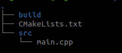
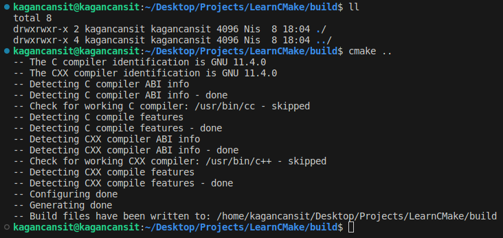
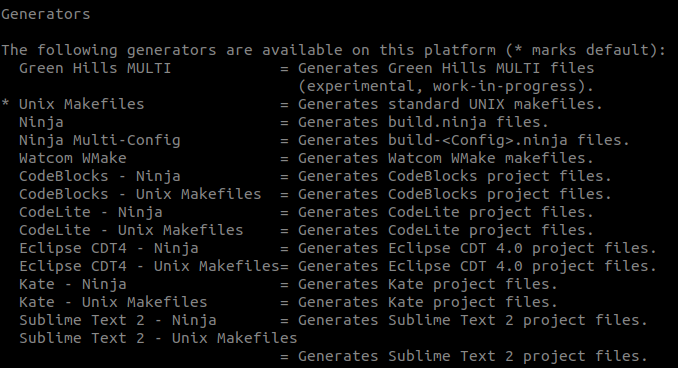
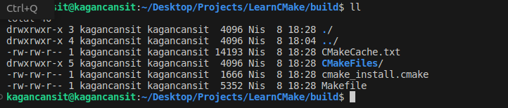
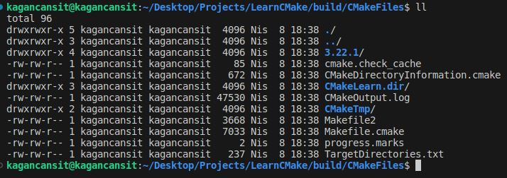
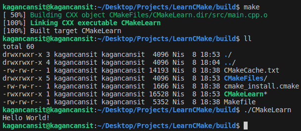
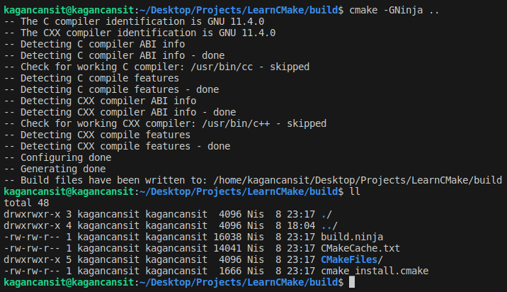
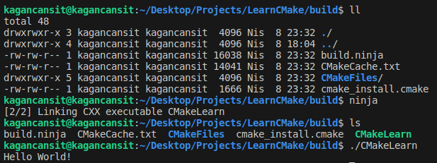

    <h1>CMake'in Temel Kullanımı</h1>
    
    
<a href="https://storyset.com/illustration/launching/amico">İllüstrasyon Kaynak Bağlantısı</a>

## Ön Hazırlık

İlerleyen süre zarfında gerçekleştirilecek tüm örnekler Linux (Ubuntu 22.04) işletim sistemine sahip bir cihaz aracılığıyla yürütülecek, anlatılacaktır. Fakat küçük bir araştırmayla istediğiniz işletim sisteminde benzer süreçleri yürütebilirsiniz.

CMake'in resmi öğretici dokümantasyonlarına ise [burada](https://cmake.org/cmake/help/latest/guide/tutorial/index.html) yer alan bağlantı aracılığıyla ulaşabilirsiniz.

Kullanım örneğine geçmeden önce çeşitli araçlar ve bileşenlere ihtiyacımız var. Bunlar, C++ kodlarını derleyebilmek ve çalıştırmak için GCC derleyicisini barındıran **build-essential** debian paketi (farklı bir derleyici (CLang, Ninja) kullanmak isterseniz o derleyiciye ait paket), CMake ile çalışabilmek için ise cmake debian paketine ihtiyacımız var.

    sudo apt install build-essential
    sudo apt install cmake

## Örnek

Temel CMake kullanımını görmek için basit bir C++ kodu yazarak süreci ilerleteceğiz. Herhangi bir metin editörü veya terminal üzerinden aşağıda yer alan dosya yapısını oluşturarak başlayalım.

    

"main.cpp" dosyamınızın içerisine meşhur örneğimizi yazarak hazır hale getirelim.

    #include <iostream>

    int main() {
        std::cout << "Hello World!" << std::endl;
        return 0;
    }

CMake direktiflerimizi belirtmek için kök dizininde önceden oluşturduğumuz **"CMakeList.txt"** dosyasını düzenleyelim.

    cmake_minimum_required(VERSION 3.22.1)
    project(CMakeLearn VERSION 0.0.1)      
    add_executable(CMakeLearn src/main.cpp)

Projemizin derlenerek kullanılabilmesi için minimum CMake versiyonunun 3.22.1 olması gerektiğini, projemizin adının CMakeLearn ve versiyonun 0.0.1 olduğunu, projeye dair yürütülebilir dosya ekleneceğini ve bu dosyanın kaynak olarak src altında yer alan main.cpp aracılığıyla oluşturularak CMakeLearn adıyla kaydedilmesini belirlemiş olduk.

İlk kısımda bahsettiğimiz kısıtlama ve bağımlıklar için bir örneğimizde olmuş oldu. CMake versiyonunu kısıtlamış olduk. Bu sayede başka bir cihaz veya platformda aynı CMake dosyası kullanılarak proje derlenmeye çalışıldığında versiyon kontrol edilecek ve uyumsuzluk olması durumunda hata alınacaktır. 

Ayrıca ek olarak aşağıda yer alan iki satırın "CMakeLists.txt" dosyasına eklenmesi durumunda projenin C++17 standardını desteklediği ve derleme işlemi için zorunlu olarak C++17 standardını destekleyen bir derleyiciye sahip olunması gerektiğini belirtebiliriz. Eğer required değeri false olarak set edilirse zorunluluk şartı bulunmayacaktır.

    set(CMAKE_CXX_STANDARD 17)
    set(CMAKE_CXX_STANDARD_REQUIRED true)

Her şeyimiz hazır. Şimdi terminal aracılığıyla build dizine gidelim. Belirlemiş olduğumuz direktifleri (**CMakeLists.txt**) kullanarak CMake'i çalıştıralım. CMake bizler için gerekli dosyaları ve içerikleri oluşturacak, belirlenen direktifleri kontrol edecektir.

    cd build/
    cmake ..

    

Pekala, şimdi bu komut sonucunda kabaca neler oldu? 

    

CMake, sistem içerisinde varsayılan olarak yer alan Unix Makefiles'ı kullanarak çeşitli özellikleri kontrol ettikten sonra yapılandırma dosyalarını **build** dizini içerisine oluşturarak bizler için otomatik olarak hazırlamış oldu.

    

    

Oluşan yapılandırma dosyalarında önemli bir dosyayı fark ettiniz mi? 

Derleyici ve işletim sistemine uygun olarak belirttiğimiz direktiflere sahip nesneler, geçici/ara dosya içerikleri ve derleme işlemini gerçekleştireceğimiz **Makefile** dosyasını elde etmiş olduk. Bu dosya aracılığıyla artık projemizi "make" komutu aracılığıyla derleyerek çalışabilir hale getirebiliriz.

    make

    

Derleme işlemi tamamlandığında ise CMake dosyasında belirttiğimiz gibi dizin içerisinde "CMakeLearn" adıyla yürütülebilir dosya içeriğimiz oluşmuş oldu. Bu yürütülebilir dosyayı çalıştırdığımızda ise başarılı bir şekilde "Hello World!" çıktısını elde etmiş olduk!

## CMake Kullanarak Farklı Derleyiciyle Uygun Makefile Oluşturmak

CMake'in bizlere sağladığı kolaylığı daha iyi anlamak için aynı kod içeriğini Ninja derleyicisiyle derleyeceğiz. (**Bu işlem için Ninja derleyicisine sahip olmanız gerekir.**) İlk olarak build dizinimizi temizleyelim ve yeniden Makefile dosyasını oluşturmak için CMake'i kullanalım.

    cd build/
    rm -rf *
    cmake -GNinja ..

    

Oluşan dosya çıktılarını incelediğimizde yukarıda yer alan çıktılardan farklı olduğunu görebilirsiniz. Şimdi hızlıca ninja komutuyla (make yerine ninja kullanılıyor) derleme işlemini gerçekleştirelim ve yürütülebilir dosyayı çalıştırarak "Hello, World!" çıktısını alalım.

    ninja

    

Farklı derleyicilerle derleme yapmak istediğinizde komut satırı üzerinden parametre geçmek zorunda değilsiniz. Bunun yerine "CMakeLists.txt" dosyasını düzenleyebilir veya terminal üzerinde "CMAKE_GENERATOR" parametresini set edebilirsiniz.

# Sonuç

CMake yardımıyla basit bir proje kodunun yönetimini, farklı derleyiciler için nasıl kullanılabileğini, platformlar arası taşınabilirlik ve zaman kazanımı için bizlere yardımcı olma potansiyelini bu örnek sayesinde denmiş olduk.

# Kaynakça

* ChatGPT 3.5'ten yardım alınmıştır.
* [CMake 2.8.12 Documentation](https://cmake.org/cmake/help/v2.8.12/cmake.html)
* [How to CMake Good - 0b - Running CMake](https://www.youtube.com/watch?v=lI2nwZSMvlE)
* [CMake Tutorial](https://cmake.org/cmake/help/latest/guide/tutorial/index.html)
* [How to Use Ninja](https://gist.github.com/jrhemstad/811d1e41af9685670241fa472170ef32)

    <a href="CMakeHakkindaGenelBilgiler.md"> < Önceki Sayfaya Dön</a> ---  
    <a href="#"> Sonraki Sayfaya İlerle ></a>

