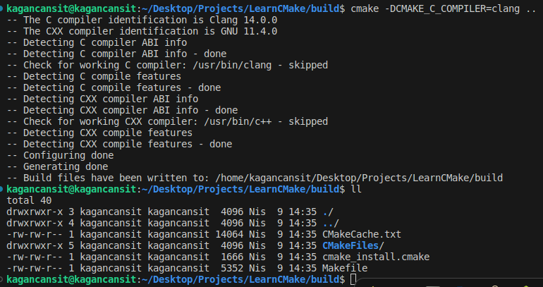
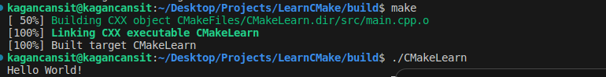

    <h1>CMake'in Temel Kullanımı</h1>
    
    
<a href="https://storyset.com/illustration/launching/amico">İllüstrasyon Kaynak Bağlantısı</a>

## Ön Hazırlık

İlerleyen süre zarfında gerçekleştirilecek tüm örnekler Linux (Ubuntu 22.04) işletim sistemine sahip bir cihaz aracılığıyla yürütülecek, anlatılacaktır. Fakat küçük bir araştırmayla istediğiniz işletim sisteminde benzer süreçleri yürütebilirsiniz.

CMake'in resmi dokümantasyonlarına ise [burada](https://cmake.org/cmake/help/latest/guide/tutorial/index.html) yer alan bağlantı aracılığıyla ulaşabilirsiniz.

Kullanım örneğine geçmeden önce çeşitli araçlar ve bileşenlere ihtiyacımız var. Bunlar, C++ kodlarını derleyebilmek ve çalıştırmak için GCC derleyicisini barındıran **build-essential** debian paketi (farklı bir derleyici (Clang vb.) kullanmak isterseniz o derleyiciye ait paket), CMake ile çalışabilmek için ise cmake debian paketine ihtiyacımız var.

    sudo apt install build-essential
    sudo apt install cmake

## Örnek

Temel CMake kullanımını görmek için basit bir C++ kodu yazarak süreci ilerleteceğiz. Herhangi bir metin editörü veya terminal üzerinden aşağıda yer alan dosya yapısını oluşturarak başlayalım.

    

"main.cpp" dosyamınızın içerisine örneğimizi yazarak hazır hale getirelim.

    #include <iostream>

    int main() {
        std::cout << "Hello World!" << std::endl;
        return 0;
    }

CMake direktiflerimizi belirtmek için kök dizininde önceden oluşturduğumuz **"CMakeList.txt"** dosyasını düzenleyelim.

    cmake_minimum_required(VERSION 3.22.1)

    project(
        CMakeLearn
        VERSION 0.0.1
        DESCRIPTION "CMake Learn Application"
        LANGUAGES CXX
    )

    add_executable(CMakeLearn src/main.cpp)

**CMakeLists.txt** betik diline dair kısa tüyolar;
- Yazılan komutlar tek satırda ele alınır.
- Parametre olarak geçilen içerikler bir dizi olarak kabul edilir. Boşluk içeren değerlerde DESCRIPTION tanımlamasında olduğu gibi tırnak kullanmalısınız.
- Değişkenlerinizi atama operatörleri değil, set fonksiyonuyla gerçekleştirmelisiniz.

        set(name "Kağan Can Şit")

- Değişken değerleri yazdırırken dolar işareti, yay ayraç içerisine değişken adını girmelisiniz. 

        message("Merhaba, ben ${name}!")

CMake'in betik dili için nitelikli olarak [bağlantıda](https://preshing.com/20170522/learn-cmakes-scripting-language-in-15-minutes/) yer alan kaynağı inceleyebilirsiniz.

Projemizin derlenmesi ve kullanılabilmesi için minimum CMake versiyonunun 3.22.1 olması gerektiğini, projemizin adının CMakeLearn ve versiyonun 0.0.1 olduğunu, projeye dair yürütülebilir dosya ekleneceğini ve bu dosyanın kaynak olarak src altında yer alan main.cpp aracılığıyla oluşturularak CMakeLearn adıyla kaydedilmesini belirlemiş olduk.

İlk kısımda bahsettiğimiz kısıtlama ve bağımlıklar için bir örneğimizde olmuş oldu. CMake versiyonunu kısıtlamış olduk. Bu sayede başka bir cihaz veya platformda aynı CMake dosyası kullanılarak proje derlenmeye çalışıldığında versiyon kontrol edilecek ve uyumsuzluk olması durumunda hata alınacaktır. 

Ayrıca ek olarak aşağıda yer alan iki satırın "CMakeLists.txt" dosyasına eklenmesi durumunda projenin C++17 standardını desteklediği ve derleme işlemi için zorunlu olarak C++17 standardını destekleyen bir derleyiciye sahip olunması gerektiğini belirtebiliriz. Eğer required değeri false olarak set edilirse zorunluluk şartı bulunmayacaktır.

    set(CMAKE_CXX_XOMPILER g++)
    set(CMAKE_CXX_STANDARD 17)
    set(CMAKE_CXX_STANDARD_REQUIRED true)

Şimdilik bu tip kısıtlama eklemeyeceğim. Her şeyimiz hazır. Şimdi terminal aracılığıyla build dizine gidelim. Belirlemiş olduğumuz direktifleri (**CMakeLists.txt**) kullanarak CMake'i çalıştıralım. CMake bizler için gerekli dosyaları ve içerikleri oluşturacak, belirlenen direktifleri kontrol edecektir.

    cd build/
    cmake ..

    

Pekala, şimdi bu komut sonucunda kabaca neler oldu?

CMake varsayılan olarak seçili olan Unix Makefiles standartına uygun olarak yapılandırma dosyalarını ve içeriklerini GNU/GCC 11.4.0 versiyonuna sahip "/usr/bin/cc" dizininde yer alan derleyicimize uygun olarak **build** dizini içerisine otomatik olarak oluşturdu.

Seçili olan makefile standardını aşağıda yer alan komut aracılığıyla kolaylıkla kontrol edebilirsiniz.

    cmake --help

    

CMake'in oluşturduğu dosya ve içeriklere yukarıdan bir bakış atalım.

    

    

Oluşan yapılandırma dosyalarında önemli bir dosyayı fark ettiniz mi? 

Derleyici ve işletim sistemine uygun olarak belirttiğimiz direktiflere sahip nesneler, geçici/ara dosya içerikleri ve derleme işlemini gerçekleştireceğimiz **Makefile** dosyasını elde etmiş olduk. Bu dosya aracılığıyla artık projemizi "make" komutu aracılığıyla derleyerek çalışabilir hale getirebiliriz.

    make

    

Derleme işlemi tamamlandığında ise **CMakeLists.txt** dosyasında belirttiğimiz gibi dizin içerisinde "CMakeLearn" adıyla yürütülebilir şekilde oluşmuş oldu. Bu dosyayı çalıştırdığımızda ise başarılı bir şekilde "Hello World!" çıktısını elde etmiş olduk!

## CMake Kullanarak Farklı Derleyiciler İçin Gerekli Dosyaları Oluşturmak

CMake'in bizlere sağladığı kolaylığı daha iyi anlamak için aynı işlemleri Clang derleyicisine uygun dosya ve içerikleri oluşturmak için gerçekleştireceğiz. **Bu işlem için Clang derleyicisine sahip olmanız gerekir.**

    sudo apt-get install clang

İlk olarak build dizinimizi temizleyelim ve yeniden Makefile dosyasını oluşturmak için CMake'i kullanalım.

    cd build/
    rm -rf *
    cmake -DCMAKE_C_COMPILER=clang ..

    

Cmake komutunun çıktısının incelediğimizde ilk kullanımımızdan farklı olarak compiler olarak Clang 14.0.0. sürümünün, "/usr/bin/clang" dizininden seçildiğini görebilirsiniz. Şimdi make komutunu çalıştırarak, yürütülebilir olarak oluşacak olan "CMakeLearn" dosyamızı elde edelim. Ardından dosyamızı çalıştırarak "Hello, World!" çıktısını alalım.

    make

    

Farklı derleyicile için işlem yapmak istediğinizde komut satırı üzerinden parametre geçmek zorunda değilsiniz. Bunun yerine "CMakeLists.txt" dosyasını düzenleyebilir veya terminal üzerinde "CMAKE_GENERATOR" parametresini set edebilirsiniz. Clang için örnek düzenlemeye [bu bağlantıdan](https://stackoverflow.com/questions/7031126/switching-between-gcc-and-clang-llvm-using-cmake) ulaşabilirsiniz.

# CMake Kullanarak Farklı Yapı Sistemi Kurallarına Uygun Dosyaları Oluşturmak

Şu ana kadar kullandığımız tüm örneklerde make komutuna uygun derleme dosyaları oluşturarak kullandık, buna alternatif olarak genellik gömülü vb. projelerde kullanılan "Ninja" için derleme dosyalarını CMake ile oluşturalım.

Bu işlem için Ninja'nın sisteminizde kurulu olması gerekir.

    sudo apt-get install ninja-build

İlk olarak build dizinimizi temizleyelim ve yeniden Makefile dosyasını oluşturmak için CMake'i kullanalım.

    cd build/
    rm -rf *
    cmake -GNinja ..

    

Oluşan dosya çıktılarını incelediğimizde yukarıda yer alan çıktılardan farklı olarak ninja için belirlenmiş dosyalarında oluştuğunu görebiliyoruz. Derleme işlemini önceki ninja komutuyla gerçekleştirelim ve yürütülebilir dosyayı çalıştırarak "Hello, World!" çıktısına alalım.

    ninja

    

# Not

Derleme işlemlerinde make ve ninja kullanacağımızı bildiğimiz için bunları tercih etsek de dışarıdan bilmediğiniz bir projeyi derlemek için aşağıdaki şekilde derleyebilirsiniz. Bu sayede farklı durumlarda uygun komutu araştırmak zorunda kalmazsınız.

Elbette bu işlemi yapabilmeniz için **"cmake .."** komutunu kullanarak gerekli dosyaları oluşturmuş olmanız gerekiyor.

    cd build/
    cmake --build .

Örnekler sırasında **rm -rf * komutu** kullanılıyor fakat make ve ninja için **help** aracılığıyla gerekli komutları **cmake --build .** ile birlikte kullanabilirsiniz. Örneğin Unix System Files ve make kullanacaksınız;

    cmake --build . --target clean
    cmake --build . --target all

# Kaynakça

* ChatGPT 3.5'ten yardım alınmıştır.
* [CMake 2.8.12 Documentation](https://cmake.org/cmake/help/v2.8.12/cmake.html)
* [How to CMake Good - 0b - Running CMake](https://www.youtube.com/watch?v=lI2nwZSMvlE)
* [CMake Tutorial](https://cmake.org/cmake/help/latest/guide/tutorial/index.html)
* [Switching between GCC and Clang/LLVM using CMake](https://stackoverflow.com/questions/7031126/switching-between-gcc-and-clang-llvm-using-cmake)
* [How to Use Ninja](https://gist.github.com/jrhemstad/811d1e41af9685670241fa472170ef32)
* [What is Ninja vs CMake](https://www.quora.com/What-is-Ninja-vs-CMake)
* [Difference between invoking `ninja` directly vs through `cmake --build`](https://stackoverflow.com/questions/70855120/difference-between-invoking-ninja-directly-vs-through-cmake-build)
* [Can you help me understand what the difference of Make, CMake, and Ninja?](https://www.reddit.com/r/embedded/comments/sbhg3q/can_you_help_me_understand_what_the_difference_of/)
* [ENCSS - CMake hands-on workshop](https://enccs.github.io/cmake-workshop/)
* [Cmake Temel (Zero to Level0.1)](https://www.youtube.com/watch?v=4rHP7FGYpMY)
* [Learn CMake's Scripting Language in 15 Minutes](https://preshing.com/20170522/learn-cmakes-scripting-language-in-15-minutes/)

    <a href="CMakeHakkindaGenelBilgiler.md"> < Önceki Sayfaya Dön</a>
    &emsp;&emsp;&emsp;&emsp;&emsp;&emsp;&emsp;&emsp;&emsp;&emsp;&emsp;&emsp;&emsp;&emsp;&emsp;&emsp;&emsp;&emsp;&emsp;&emsp; 
    <a href="CMakeKutuphaneEklemek.md"> Sonraki Sayfaya İlerle ></a>

