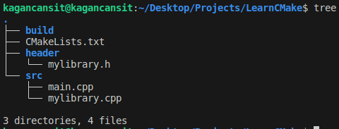
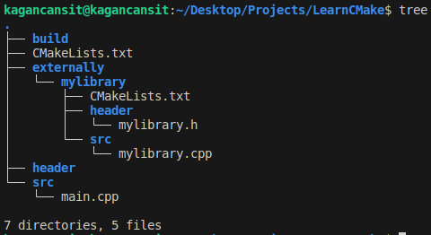
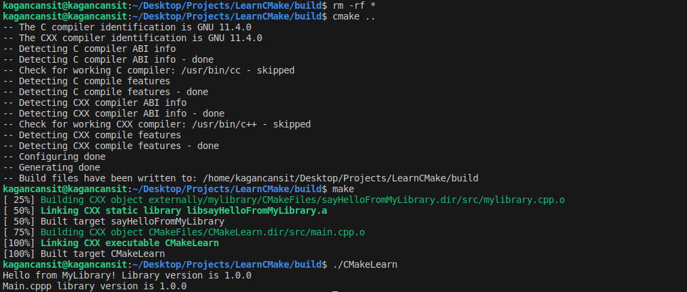

    <h1>Projeyi Alt Dizinlere Ayırmak Ve Yönetmek</h1>
    
    
<a href="https://storyset.com/illustration/code-snippets/pana">SVG Kaynak Bağlantısı</a>

Günümüzde, geliştirilen ve kullanılan yazılımlar genellikle çeşitli işlevleri yerine getirmek için birden fazla alt modülü içerir. Bu modüller, kod tekrarlarını önlemeyi ve projenin yönetilmesini kolaylaştırmayı amaçlar. Ayrıca genellikle açık kaynak olarak sunulan dış kütüphaneleri veya araçları bünyesinde barındırırlar. 

Bu kullanımlar bir yazılım projesini daha nitelikli, işlevsel hale getirirken aynı zamanda karmaşıklığı arttırabilir. Yazılımınıza dahil ettiğiniz çeşitli içerikleri kendi projeniz doğrultusunda düzenlemeniz, hedeflediğiniz işleyiş için verimli ve kullanışlı hale getirmeniz gerekir. Ayrıca birden fazla bağımlılığı ve farklılıkları bulunabilir. 

CMake, projenizi alt dizinlere ayırmanıza ve yönetmenize olanak tanır. Her alt modülün kendine ait bir **CMakeList.txt** dosyası bulunabilir. Bu dosyalar aracılığıyla gereksinimlerinizi düzenleyebilir ve daha esnek bir yapı oluşturabilirsiniz.

Bu dokümanda önceki örneğimizde oluşturduğumuz kütüphane içeriğini bir klasör altında modül olarak ele alıp, **CMake** konfigürasyonumuzu bu doğrultuda düzenlemeye çalışacağız. Dizin yapımız son düzenlemelerle aşağıdaki şekilde oluşmuştu. Şimdi ekledeğimiz kütüphanenin ayrı olarak kendi dizini altında yer alacağını farzederek düzenleme yapalım.

    

Bu örnek için dış kaynakları kullanacağımız bir **externally** dizini oluşturup, ardından bu dizinin içerisine **mylibrary** adında bir dizin daha oluşturalım. **mylibrary.h** ve **mylirary.cpp** içeriklerini src ve header dizinleri içerisine alarak taşıyalım. Son olarak kütüphanemizin yapısını ve derlenmesi belirlemek için **mylibrary** dizini içerisine ana yapıda bulunan CMake dosyamızdan farklı olarak bir **CMakeLists.txt** dosyası daha oluşturalım.

    

**Örnek olması adına dizin yapımızı bu şekilde hazırladık. Sizler kendi projenize uygun yapıyı oluşturabilirsiniz.**

Şu an kütüphane içeriğimizi bir alt dizine taşıdık. Bu sebeple **ilk oluştuduğumuz ana dizinde bulunan** CMake konfigürasyonumuzu güncelleyerek alt dizini bildirmeliyiz. Bunun için **add_subdirectory()** fonksiyonunu kullanacağız.

    cmake_minimum_required(VERSION 3.22.1)
    project(
        CMakeLearn
        VERSION 0.0.1
        DESCRIPTION "CMake Learn Application"
        LANGUAGES CXX
    )   

    add_subdirectory(externally/mylibrary)

    add_library(
        sayHelloFromMyLibrary
        header/mylibrary.h
        src/mylibrary.cpp
    )

    add_executable(CMakeLearn src/main.cpp)
    target_link_libraries(CMakeLearn PRIVATE sayHelloFromMyLibrary)

Bu değişiklik maalesef yeterli değil. Çünkü şu an konfigürasyon dosyamızda yer alan **add_library** fonksiyonunun parametreleri ve aradığı dizin dosyaları doğru değil! Bu kısımı kütüphaneyi dışarıdan kullanacağımız ve kütüphaneye ait olan **externally/mylibrary/CMakeLists.txt** dosyasına taşıyacağız. Ayrıca eklediğimiz kütüphanenin üst dizinden kullanılabilmesi için kütüphane çıktımızı dizine dahil edecek, versiyonunu takip etmek için ise ön işlemci tanımı ekleyeceğiz.

    add_library(
        sayHelloFromMyLibrary
        header/mylibrary.h
        src/mylibrary.cpp
    )

    target_include_directories(
        sayHelloFromMyLibrary
        PUBLIC
        ${CMAKE_CURRENT_SOURCE_DIR}/header
    )

    target_compile_definitions(
        sayHelloFromMyLibrary
        PUBLIC
        MY_LIBRARY_VERSION="1.0.0"
    )

Bu düzenleme sonucunda **mylibrary** içeriğinin üst dizinde yer alan header klasörüne dahil edilmesi sağladık. Şu an projemizin **cmake** tarafından işlendiğini ve hata oluşmadan **make** ile derlendiğini görebilirsiniz. Kütüphanenin versiyon bilgisini ise **mylibrary.cpp** ve **main.cpp** içerisinde yazdırabiliriz.

*mylibrary.cpp*

    #include "../header/mylibrary.h"

    void libHello() {
        std::cout << "Hello from MyLibrary! Library version is " << MY_LIBRARY_VERSION << std::endl;
    }

*main.cpp*

    #include <iostream>
    #include "mylibrary.h"

    int main() {
        libHello();
        std::cout << "Main.cppp library version is " << MY_LIBRARY_VERSION << std::endl;
        return 0;
    }

    

Bu düzenlemeler sonucunda projemizin modüler yapısını daha iyi organize edebilir ve her bir modülü bağımsız olarak yönetebiliriz. Ayrıca, CMake'in sunduğu diğer özellikleri de kullanarak projenizi daha da geliştirebilirsiniz.

# Kaynakça

* ChatGPT 3.5'ten yararlanılmıştır.
* [CMake 2.8.12 Documentation](https://cmake.org/cmake/help/v2.8.12/cmake.html)
* [CMake Tutorial](https://cmake.org/cmake/help/latest/guide/tutorial/index.html)
* [ENCSS - CMake hands-on workshop](https://enccs.github.io/cmake-workshop/)
* [How to CMake Good - 1c - Subdirectories and Target Interface Properties](https://www.youtube.com/watch?v=SYgESCQeGJY)

    <a href="CMakeKutuphaneEklemek.md"> < Ana Sayfaya Dön</a>
    &emsp;&emsp;&emsp;&emsp;&emsp;&emsp;&emsp;&emsp;&emsp;&emsp;&emsp;&emsp;&emsp;&emsp;&emsp;&emsp;&emsp;&emsp;&emsp;&emsp; 
    <a href="CMakeinBetikDili.md"> Sonraki Sayfaya İlerle ></a>

